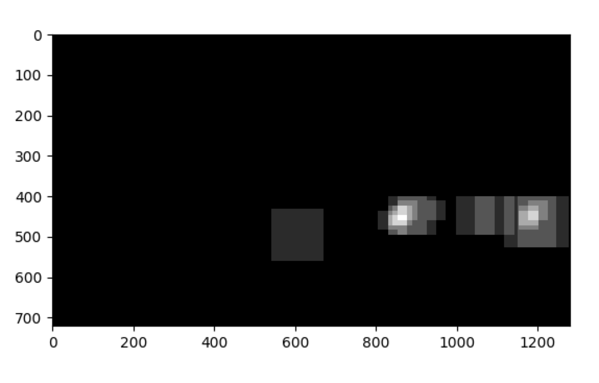

# Vehicle Detection using Computer Vision
 
## Introduction

This repository contains code in Python to detect vehicles in a video using computer vision and machine learning techniques. The input video is recorded by a camera placed in front of the car. This repository was submitted as a project for Udacity's Self Driving Car Nanodegree. For more information please visit - [Udacity's Self Driving Car Nanodegree](https://www.udacity.com/course/self-driving-car-engineer-nanodegree--nd013)

## Solution Overview

The following is a step by step procedure on how the solution was achieved. A classifier was trained on extracted images from the training data. The pipeline steps were repeated for each frame of the video to create the final video output which can be found [here](project_video_out.mp4)

### Feature Extraction and Training

1. Load the set of cars and non-car images.
2. Extract the histogram of colors for each image
3. Extract the spatial features ofeach image
4. Extract the Histogram of Gradients for each image
5. Scale all the above features to avoid bias for a particular set of features and vectorize the features
6. Split data into training and test data, and train a SVC classifier on the extracted features until a good test accuracy is reached
7. Save the features data and the model to be used for later

### Pipeline

These steps are to be applied for each frame of the image from the video - 

1. Normalise the pixels of the image to match the feature vectors's scale
2. Create a list of search windows with varying dimensions on the region of interest
3. Extract the features on each of the search windows using the same training parameters and make a prediction
4. Draw a heatmap over all of the predicted windows after thresholding the confidence value
5. Average the heatmap over multiple frames and detect windows after removing false positives
6. Combine smaller boxes into a single box if the distance between the boxes are very small
7. Calculate the new center of the box by averaging over multiple frames if the box overlaps other boxes previously found
8. Draw the final boxes over the image and return the processed image

## Explanation
  
### Feature Extraction

The data was split into cars and not-cars each containing 8000+ samples. Here are some images from the dataset - 

#### Samples from Cars Dataset


#### Samples from Not-cars Dataset


The features selected for classification were - 

1. Histogram of Colors
2. Spatial Binning
3. Histogram of Gradients

For the histogram of colors it was important that the features were selected from a color space that differentiated the features better. From a comparison of all available color spaces YCrCb was selected as it had most variations between the two different data types as you can see from the histogram below - 

#### YCrCb Histogram of a Car


#### YCrCb Histogram of a Non-car


The YCrCb features were then organized into 16 bins. 

The images were resized to 16x16 to reduce size of the feature vectors and faster training. Each channel of the image was spatially reduced and then stacked together to form the spatial vector feature like this - 
 
```
utils.py ln:48

def bin_spatial(img, size=(32, 32)):
    '''
    Function to get the spatial feature vector
    :param img: The image to extract features from
    :param size: the new spatial size
    :return: the spatial feature vector
    '''
    color1 = cv2.resize(img[:, :, 0], size).ravel()
    color2 = cv2.resize(img[:, :, 1], size).ravel()
    color3 = cv2.resize(img[:, :, 2], size).ravel()

    # stack all color channels and return
    return np.hstack((color1, color2, color3))
```

The parameters selected for the HOG features were - 
 
 * orientations - 9
 * pixels per cell - 8
 * cells per block - 2
 * channels - 0, 1, 2

 The above parameters gave me the best performance both in terms of speed and accuracy. The HOG features of the sample data look like this - 
 
 
 
You can find the implementation using scikit's hog function here - 
```
utils.py ln:83

def get_hog_features(img, orient, pix_per_cell, cell_per_block,
                     vis=False, feature_vec=True):
    '''
    Function to get the Histogram of Gradients for an image
    :param img: the image to extract feature from
    :param orient: the HOG orientations
    :param pix_per_cell: the number of pixels per cell
    :param cell_per_block: the number of cells per block
    :param vis: boolean to indicate the HOG of the image should be returned
    :param feature_vec: boolean to indicate the features must be vectorized
    :return: the HOG features and the image
    '''
    # Call with two outputs if vis==True
    if vis == True:
        features, hog_image = hog(img, orientations=orient,
                                  pixels_per_cell=(pix_per_cell, pix_per_cell),
                                  cells_per_block=(cell_per_block, cell_per_block),
                                  transform_sqrt=False,
                                  visualise=vis, feature_vector=feature_vec)
        return features, hog_image
    # Otherwise call with one output
    else:
        features = hog(img, orientations=orient,
                       pixels_per_cell=(pix_per_cell, pix_per_cell),
                       cells_per_block=(cell_per_block, cell_per_block),
                       transform_sqrt=False,
                       visualise=vis, feature_vector=feature_vec)
        return features

```

The final feature vector for each image had a length of 6108. The features were then scaled uniformly to avoid bias between features using scikit's StandardScaler like this - 

```
train.py ln:170

# scale the features
X_scaler = StandardScaler().fit(X)
X_scaled = X_scaler.transform(X)
```

The scaled features were then saved in a file for later use by the classifier.

### Classifier Training

A support vector machine was trained over the extracted features for 1000 iterations to achieve a test accuracy of 98.96%. The total training time was 29.94 seconds on my Macbook Pro 2015. The Support Vector Machine classifier was selected as a Decision Tree classfier did not converge even after more than 800 seconds of training while a Naive Bayes classifier had an accuracy of 91.67% after 1000 iterations.

scikit's LinearSVC was used to create the classifier and train it - 

```
train.py

ln:241 model = LinearSVC()

...

ln:252 model.fit(X_train, y_train)

```

### Sliding Window Search

As the first step in the detection pipeline sliding windows of increasing dimensions were generated in the region of interest. This was done as the dimension of the cars were smaller towards the horizon and larger near the field of view. The following dimensions were selected for the sliding windows - 

```
detector.py ln:466

# define varying sliding window dimensions to search for the cars
windows = []
windows = self.get_all_windows(norm, x_bounds=(350, None), y_bounds=(400, 500),
                               window_dim=(48, 48), overlap=(0.75, 0.75))
windows += self.get_all_windows(norm, x_bounds=(350, None), y_bounds=(400, 600),
                                window_dim=(96, 96), overlap=(0.75, 0.75))
windows += self.get_all_windows(norm, x_bounds=(350, None), y_bounds=(400, 650),
                                window_dim=(128, 128), overlap=(0.75, 0.75))
```

As you can see 350 pixels of width from the start and 400 pixels of height from the top were removed from the ROI. The height was also restricted to 650 pixels from the top. This image shows all the sliding windows generated by the above code -
  


### Prediction and False Positives

Features were extracted from each patch of image under the sliding windows generated using the parameters defined during training. It was observed that this generated a lot of false positives (usually lane patches). The false positives were then significantly reduced by thresholding the decision function of the classifier like this - 
   
```
detector.py ln:113

# predict a value using the classifier. Threshold the prediction based on the confidence
prediction = self.clf.predict(features_scaled)
conf = self.clf.decision_function(features_scaled)
if prediction == 1 and conf > 0.4:
    pred_windows.append(window)
```

Further a heatmap was generated over all the predicted windows and the heatmap was integrated over multiple frames to remove windows with fewer detections.

This is how a heatmap of the predicted windows look like - 


### Integrated Heatmaps

The windows detected had varying centres and dimensions over multiple frames. To smoothen the jittering effect that this caused and also the false positives, the following steps were followed - 

1. The heatmaps were combined over multiple frames to remove detections not meeting a certain threshold.
2. The boxes that were very close to each other were combined to form one large box instead of many small boxes over the same car. The boxes were determined to be close to each other based on the distance between their centres and their radius.
3. The center and dimensions of the boxes were averaged out over multiple frames so that it doesn't vary much during video playback.

The entire code for this can be found in detector.py. Here is a small snippet that implements the average functionality - 

```
detector.py ln:192

def fix_boxes(self, bboxes):
    '''
    Method to find the center of the boxes and smoothen it to avoid jitters
    :param bboxes: list of bounding boxes
    :return: the final list of bounding boxes to be used
    '''
    result = []
    old_boxes = self.boxes[:]

    # for each of the new box iterate over the old boxes and find the closest match
    # move to new centre and average the dimensions if match is found
    for box in bboxes:
        found = False

        for old_box in old_boxes:
            # check if boxes overlap
            if self.is_overlapping_box(old_box, box):
                found = True

                # if boxes overlap calculate new box center by getting the average
                new_box_center = self.get_avg_center(self.get_box_center(old_box), self.get_box_center(box))

                # get the dimensions of the boxes
                w1, h1 = self.get_box_dim(old_box)
                w2, h2 = self.get_box_dim(box)

                # calculate the x and y offset
                w = (w1 + w2) // 4
                h = (h1 + h2) // 4

                # calcuate the new box positions and append to the result
                new_box = (new_box_center[0] - w, new_box_center[1] - h), (
                    new_box_center[0] + w, new_box_center[1] + h)
                result.append(new_box)
                break

        # if a match was not found append the box as it is to the list
        if not found:
            result.append(box)

    # if self.processed_frames % self.avg_frames == 0:
    #     self.boxes = []
    # else:
    # set the result to the recent boxes property
    self.boxes = result

    # return the final result
    return result
```

### 

  
## Code Summary

1. train.py

    This file contains code to load data and train a classifier to predict cars and non-cars. It saves the features and the classifier model to a file so that it can be reused.
    
2. extractor.py

    This file contains code to extract features from images and vectorize it. This feature vector is used by train.py to train the classifier.
    
3. detector.py

    All the steps in the pipeline are implemented in this file. 
 
 4. main.py
 
    Trains the classifier, loads the input video and runs the pipeline for each of the frame. 
 
 5. utils.py
    
    Contains common methods used by all files.


## Future Considerations

1. The detection could be made more robust and less jittery by implementing a confidence of detection based approach instead of a simple averaging method.
2. The final video still has some false positives which I believe can be eliminated with better tuning of the sliding windows and the heatmap threshold.
3. The training images used are not very generic and seem to be more specific to the input video. By improving the dataset a more generic solution can be arrived.
4. The solution could be improved by predicting the movement of the detected vehicles and estimating the expected size in the field of view to vary the sliding search windows correspondingly or use template matching of the resized detected vehicle.